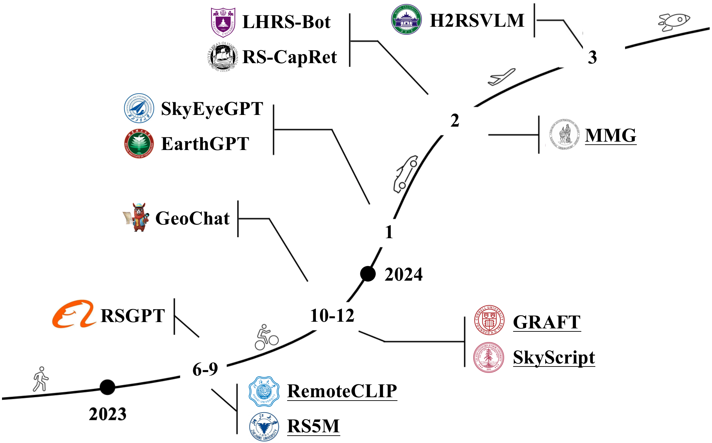

[](https://github.com/sindresorhus/awesome)
[](https://github.com/zytx121/Awesome-VLGFM/pulls)
<br />
<p align="center">
  <h1 align="center">Towards Vision-Language Geo-Foundation Models: A Survey</h1>
  <p align="center">
    <b> arXiv, 2024 </b>
    <br />
    <a href="https://zytx121.github.io/"><strong>Yue Zhou </strong></a>
    ·
    <a href="https://scholar.google.com/citations?user=PnNAAasAAAAJ"><strong> Litong Feng </strong></a>
<!--     ·
    <a href="https://dr.ntu.edu.sg/cris/rp/rp00908/"><strong> Yiping Ke </strong></a> -->
    ·
    <a href="https://sp.sjtu.edu.cn/"><strong> Xue Jiang </strong></a>
    ·
    <a href="https://scholar.google.com/citations?user=ga230VoAAAAJ"><strong> Junchi Yan </strong></a>
    ·   
    <a href="https://yangxue0827.github.io/"><strong> Xue Yang </strong></a>
    ·
    <a href="https://scholar.google.com/citations?user=5GtyVooAAAAJ"><strong> Wayne Zhang </strong></a>
    
  </p>

  <p align="center">
    <a href='https://arxiv.org/abs/2406.09385'>
      
    </a>
<!--     <a href='https://ieeexplore.ieee.org/document/'>
      
    </a> -->
  </p>
<br />

This repo is used for recording, tracking, and benchmarking several recent vision-language geo-foundation models (VLGFM) to supplement our [survey](https://arxiv.org/abs/). If you find any work missing or have any suggestions (papers, implementations, and other resources), feel free to [pull requests](https://github.com/zytx121/Awesome-VLGFM/pulls).
We will add the missing papers to this repo as soon as possible.

### 🙌 Add Your Paper in our Repo and Survey!!!!!

- You are welcome to give us an issue or PR for your VLGFM work !!!!!

- Note that: Due to the huge paper in Arxiv, we are sorry to cover all in our survey. You can directly present a PR into this repo and we will record it for next version update of our survey.

<!-- [-] **Our survey will be updated in 2024.3.** -->


### 🥳 New

🔥🔥🔥 Last Updated on 2025.05.24 🔥🔥🔥

- **2025.05.24**: Update ImageRAG.
- **2025.02.16**: Update UniRS, REO-VLM, GeoPixel. 
- **2025.01.14**: Update GeoPix.
- **2024.12.25**: Update VHM (accepted by AAAI'2025), which is a new version of H2RSVLM.
- **2024.12.21**: Update EarthDial.


### ✨ Highlight!!

-  The first survey for vision-language geo-foundation models, including contrastive/conversational/generative geo-foundation models.

-  It also contains several related works, including exploration and application of some downstream tasks. 

-  We list detailed results for the most representative works and give a fairer and clearer comparison of different approaches.


## 📖 Introduction

This survey presents the first detailed survey on remote sensing vision language foundation models, including Contrastive/Conversational/Generative VLGFMs.



## 📗 Summary of Contents

- [📖 Introduction](#introduction)
- [📗 Summary of Contents](#summary-of-contents)
- [📚 Methods: A Survey](#methods-a-survey)
  - [Contrastive VLGFMs](#contrastive-vlgfms)
  - [Conversational VLGFMs](#conversational-vlgfms)
  - [Generative VLGFMs](#generative-vlgfms)
  - [Datasets & Benchmarks](#datsets_&_benchmarks)
- [🕹️ Application](#application)
  - [Captioning](#captioning)
  - [Retrieval](#retrieval)
  - [Change Detection](#change-detection)
  - [Scene Classification](#scene-classification)
  - [Segmentation](#segmentation)
  - [Visual Question Answering](#visual-question-answering)
  - [Geospatial Localization](#geospatial-localization)
  - [Super-Resolution](#super-resolution)
- [📊 Exploration](#exploration)
- [👨‍🏫 Survey](#survey)
- [🖊️ Citation](#citation)
- [🐲 Contact](#contact)

## 📚 Methods: A Survey

**Keywords**

- `clip`: Use CLIP
- `llm`: Use LLM (Large Language Model)
- `sam`: Use SAM (Segment Anything Model)
- `i-t`: Annotate using image-text tuples
- `v-t`: Annotate using video-text tuples
- `i-t-b`: Annotate using image-text-box triplets
- `i-t-m`: Annotate using image-text-mask triplets


image-caption-mask triplets


### Contrastive VLGFMs

|Year|Venue|Keywords|Paper Title|Code/Project|
|:-:|:-:|:-:|-|-|
|2024|TGRS|`clip`|[RS5M and GeoRSCLIP: A Large Scale Vision-Language Dataset and A Vision-Language Foundation Model for Remote Sensing](https://arxiv.org/abs/2306.11300)|[Code](https://github.com/om-ai-lab/RS5M)|
|2024|ICLR |`clip`|[GRAFT: Remote Sensing Vision-Language Foundation Models without Annotations via Ground Remote Alignment](https://arxiv.org/abs/2312.06960)|[Project](https://graft.cs.cornell.edu)|
|2024|AAAI|`clip`|[SkyScript: A Large and Semantically Diverse Vision-Language Dataset for Remote Sensing](https://arxiv.org/abs/2312.12856)|[Code](https://github.com/wangzhecheng/SkyScript)|
|2024|arXiv|`clip`|[Mind the Modality Gap: Towards a Remote Sensing Vision-Language Model via Cross-modal Alignment](https://arxiv.org/abs/2402.09816)|N/A|
|2024|TGRS|`clip`|[RemoteCLIP: A Vision Language Foundation Model for Remote Sensing](https://arxiv.org/abs/2306.11029)|[Code](https://github.com/ChenDelong1999/RemoteCLIP)|


### Conversational VLGFMs

|Year|Venue|Keywords|Paper Title|Code/Project|
|:-:|:-:|:-:|-|-|
|2023|arXiv|`llm`|[Rsgpt: A remote sensing vision language model and benchmark](https://arxiv.org/abs/2307.15266)|[Code](https://github.com/Lavender105/RSGPT)|
|2024|CVPR|`llm`|[GeoChat: Grounded Large Vision-Language Model for Remote Sensing](https://arxiv.org/abs/2311.15826)|[Code](https://github.com/mbzuai-oryx/geochat)|
|2024|arXiv|`llm`|[SkyEyeGPT: Unifying Remote Sensing Vision-Language Tasks via Instruction Tuning with Large Language Model](https://arxiv.org/abs/2401.09712)|[Code](https://github.com/ZhanYang-nwpu/SkyEyeGPT)|
|2024|TGRS|`llm`|[Earthgpt: A universal multi-modal large language model for multi-sensor image comprehension in remote sensing domain](https://arxiv.org/abs/2401.16822)|N/A|
|2024|ECCV|`llm`|[LHRS-Bot: Empowering Remote Sensing with VGI-Enhanced Large Multimodal Language Model](https://arxiv.org/abs/2402.02544)|[Code](https://github.com/NJU-LHRS/LHRS-Bot)|
|2024|arXiv|`llm`|[Popeye: A Unified Visual-Language Model for Multi-Source Ship Detection from Remote Sensing Imagery](https://arxiv.org/abs/2403.03790)|N/A|
|2024|arXiv|`llm`|[Large Language Models for Captioning and Retrieving Remote Sensing Images](https://arxiv.org/abs/2402.06475)|N/A|
|2024|arXiv|`llm`|[H2RSVLM: Towards Helpful and Honest Remote Sensing Large Vision Language Model](https://arxiv.org/abs/2403.20213)|N/A|
|2024|RS|`llm`|[RS-LLaVA: A Large Vision-Language Model for Joint Captioning and Question Answering in Remote Sensing Imagery](https://www.mdpi.com/2072-4292/16/9/1477)|[Code](https://github.com/BigData-KSU/RS-LLaVA)|
|2024|arXiv|`llm`|[SkySenseGPT: A Fine-Grained Instruction Tuning Dataset and Model for Remote Sensing Vision-Language Understanding](https://arxiv.org/abs/2406.10100)|[Code](https://github.com/Luo-Z13/SkySenseGPT)|
|2024|arXiv|`llm`|[EarthMarker: A Visual Prompt Learning Framework for Region-level and Point-level Remote Sensing Imagery Comprehension](https://github.com/wivizhang/EarthMarker)|[Code](https://github.com/wivizhang/EarthMarker)|
|2024|arXiv|`llm`|[TEOChat: A Large Vision-Language Assistant for Temporal Earth Observation Data](https://arxiv.org/abs/2410.06234)|[Code](https://github.com/ermongroup/TEOChat)|
|2024|arXiv|`llm`|[Aquila: A Hierarchically Aligned Visual-Language Model for Enhanced Remote Sensing Image Comprehension](https://arxiv.org/abs/2411.06074)|N/A|
|2024|arXiv|`llm`|[GeoGround: A Unified Large Vision-Language Model for Remote Sensing Visual Grounding](https://arxiv.org/abs/2411.11904)|[Code](https://github.com/zytx121/GeoGround)|
|2024|arXiv|`llm`|[LHRS-Bot-Nova: Improved Multimodal Large Language Model for Remote Sensing Vision-Language Interpretation](https://arxiv.org/abs/2411.09301)|[Code](https://github.com/NJU-LHRS/LHRS-Bot)|
|2024|arXiv|`llm`|[GeoLLaVA: Efficient Fine-Tuned Vision-Language Models for Temporal Change Detection in Remote Sensing](https://arxiv.org/abs/2410.19552)|N/A|
|2024|arXiv|`llm`|[RS-MoE: Mixture of Experts for Remote Sensing Image Captioning and Visual Question Answering](https://arxiv.org/abs/2411.01595)|N/A|
|2024|TGRS|`llm`|[RingMoGPT: A Unified Remote Sensing Foundation Model for Vision, Language, and grounded tasks](https://ieeexplore.ieee.org/document/10777289)|N/A|
|2024|arXiv|`llm`|[RSUniVLM: A Unified Vision Language Model for Remote Sensing via Granularity-oriented Mixture of Experts](https://arxiv.org/abs/2412.05679)|[Code](https://github.com/xuliu-cyber/RSUniVLM)|
|2024|arXiv|`llm`|[EarthDial: Turning Multi-sensory Earth Observations to Interactive Dialogues](https://arxiv.org/abs/2412.15190)|N/A|
|2024|arXiv|`llm`|[UniRS: Unifying Multi-temporal Remote Sensing Tasks through Vision Language Models](https://arxiv.org/abs/2412.20742v1)|N/A|
|2024|arXiv|`llm`|[REO-VLM: Transforming VLM to Meet Regression Challenges in Earth Observation](https://arxiv.org/abs/2412.16583)|N/A|
|2025|AAAI|`llm`|[VHM: Versatile and Honest Vision Language Model for Remote Sensing Image Analysis](https://arxiv.org/abs/2403.20213v4)|[Code](https://github.com/opendatalab/VHM)|
|2025|arXiv|`llm`|[GeoPix: Multi-Modal Large Language Model for Pixel-level Image Understanding in Remote Sensing](https://arxiv.org/abs/2501.06828)|N/A|
|2025|arXiv|`llm`|[GeoPixel: Pixel Grounding Large Multimodal Model in Remote Sensing](https://arxiv.org/abs/2501.13925)|[Code](https://github.com/mbzuai-oryx/GeoPixel)]|
|2025|GRSM|`llm`|[ImageRAG: Enhancing Ultra High Resolution Remote Sensing Imagery Analysis with ImageRAG](https://arxiv.org/abs/2411.07688)|[Code](https://github.com/om-ai-lab/ImageRAG)]|


### Generative VLGFMs

|Year|Venue|Keywords|Paper Title|Code/Project|
|:-:|:-:|:-:|-|-|
|2024|ICLR||[DiffusionSat: A Generative Foundation Model for Satellite Imagery](https://arxiv.org/abs/2312.03606)|[Code](https://github.com/samar-khanna/DiffusionSat)|
|2024|arXiv||[CRS-Diff: Controllable Generative Remote Sensing Foundation Model](https://arxiv.org/abs/2403.11614)|N/A|
|2024|arXiv||[MetaEarth: A Generative Foundation Model for Global-Scale Remote Sensing Image Generation](https://arxiv.org/abs/2405.13570)|[Code](https://jiupinjia.github.io/metaearth/)|
|2024|arXiv||[HSIGene: A Foundation Model For Hyperspectral Image Generation](https://arxiv.org/abs/2409.12470)|[Code](https://github.com/LiPang/HSIGene)|


### Datasets & Benchmark
|Year|Venue|Keywords|Name|Code/Project|Download|
|:-:|:-:|:-:|-|-|-|
|2016|CITS|`i-t`|[Sydney-Captions & UCM-Captions](https://ieeexplore.ieee.org/abstract/document/7546397)|[N/A]|[link](https://pan.baidu.com/s/1mjPToHq#list/path=%2F),[link2](https://pan.baidu.com/s/1hujEmcG#list/path=%2F)|
|2017|TGRS|`i-t`|[RSICD](https://ieeexplore.ieee.org/document/8240966)|[Project](https://github.com/201528014227051/RSICD_optimal)|[Link](https://pan.baidu.com/s/1bp71tE3#list/path=%2F)|
|2020|TGRS|`i-t`|[RSVQA-LR & RSVQA-HR](https://arxiv.org/abs/2003.07333)|[Project](https://rsvqa.sylvainlobry.com)|[link1](https://zenodo.org/records/6344334),[link2](https://zenodo.org/records/6344367)|
|2021|IGARSS|`i-t`|[RSVQAxBEN](https://rsvqa.sylvainlobry.com/IGARSS21.pdf)|[Project](https://rsvqa.sylvainlobry.com)|[link](https://zenodo.org/records/5084904)|
|2021|Access|`i-t`|[FloodNet](https://ieeexplore.ieee.org/abstract/document/9460988)|[Project](https://github.com/BinaLab/FloodNet-Supervised_v1.0)|[link](https://drive.google.com/drive/folders/1leN9eWVQcvWDVYwNb2GCo5ML_wBEycWD)|
|2021|TGRS|`i-t`|[RSITMD](https://ieeexplore.ieee.org/document/9437331)|[Code](https://github.com/xiaoyuan1996/AMFMN)|[link](https://drive.google.com/file/d/1NJY86TAAUd8BVs7hyteImv8I2_Lh95W6/view)|
|2021|TGRS|`i-t`|[RSIVQA](https://ieeexplore.ieee.org/document/9444570)|[Code](https://github.com/spectralpublic/RSIVQA)|[link](https://github.com/spectralpublic/RSIVQA/tree/main/RSIVQA)|
|2022|TGRS|`i-t`|[NWPU-Captions](https://ieeexplore.ieee.org/document/9866055)|[Project](https://github.com/HaiyanHuang98/NWPU-Captions)|[link](https://github.com/HaiyanHuang98/NWPU-Captions)|
|2022|TGRS|`i-t`|[CRSVQA](https://ieeexplore.ieee.org/abstract/document/10242124)|[Project](https://github.com/MeimeiZhang-data/MQVQA)|[link](https://drive.google.com/file/d/12DQwGzJ5OQK1rU0T5CmpNN9bEs38x_mQ/view)|
|2022|TGRS|`i-t`|[LEVIR-CC](https://ieeexplore.ieee.org/abstract/document/9934924)|[Project](https://github.com/Chen-Yang-Liu/RSICC)|[link](https://github.com/Chen-Yang-Liu/LEVIR-CC-Dataset)|
|2022|TGRS|`i-t`|[CDVQA](https://ieeexplore.ieee.org/abstract/document/9901476)|[Project](https://github.com/YZHJessica/CDVQA)|[link](https://github.com/YZHJessica/CDVQA)|
|2022|TGRS|`i-t`|[UAV-Captions](https://ieeexplore.ieee.org/document/9521989)|N/A|N/A|
|2022|MM|`i-t-b`|[RSVG](https://dl.acm.org/doi/abs/10.1145/3503161.3548316)|[Project](https://sunyuxi.github.io/publication/GeoVG)|[link](https://drive.google.com/file/d/1kgnmVC6FVKdxCwaoG77sOfkaIHS_XiFt/view)|
|2022|RS|`v-t`|[CapERA](https://www.mdpi.com/2072-4292/15/8/2139)|[Project](https://lcmou.github.io/ERA_Dataset/)|[link](https://drive.google.com/file/d/1yxXjDNAq5RAufSgSOE4QmdsNfAc4dOfM/view)|
|2023|TGRS|`i-t-b`|[DIOR-RSVG](https://ieeexplore.ieee.org/abstract/document/10056343)|[Project](https://github.com/ZhanYang-nwpu/RSVG-pytorch)|[link](https://drive.google.com/drive/folders/1hTqtYsC6B-m4ED2ewx5oKuYZV13EoJp_)|
|2023|arXiv|`i-t`|[RemoteCount](https://arxiv.org/abs/2306.11029)|[Code](https://github.com/ChenDelong1999/RemoteCLIP)|N/A|
|2023|arXiv|`i-t`|[RS5M](https://arxiv.org/abs/2306.11300)|[Code](https://github.com/om-ai-lab/RS5M)|[link](https://huggingface.co/datasets/Zilun/RS5M)|
|2023|arXiv|`i-t`|[RSICap & RSIEval](https://arxiv.org/abs/2307.15266)|[Code](https://github.com/Lavender105/RSGPT)|N/A|
|2023|arXiv|`i-t`|[LAION-EO](https://arxiv.org/abs/2309.15535)|N/A|[link](https://huggingface.co/datasets/mikonvergence/LAION-EO)|
|2023|ICCVW|`i-t`|[SATIN](https://arxiv.org/abs/2304.11619)|[Project](https://satinbenchmark.github.io/)|[link](https://huggingface.co/datasets/jonathan-roberts1/SATIN)|
|2024|ICLR |`i-t`|[NAIP-OSM](https://arxiv.org/abs/2312.06960)|[Project](https://graft.cs.cornell.edu)|N/A|
|2024|AAAI|`i-t`|[SkyScript](https://arxiv.org/abs/2312.12856)|[Code](https://github.com/wangzhecheng/SkyScript)|[link](https://github.com/wangzhecheng/SkyScript#download)|
|2024|AAAI |`i-t-m`|[EarthVQA](https://arxiv.org/abs/2312.12222)|[Project](https://junjuewang.top/EarthVQA)|N/A|
|2024|TGRS|`i-t-m`|[RRSIS](https://ieeexplore.ieee.org/abstract/document/10458079)|[Code](https://gitlab.lrz.de/ai4eo/reasoning/rrsis)|[link](https://huggingface.co/datasets/JessicaYuan/RefSegRS)|
|2024|CVPR|`i-t`|[GeoChat-Instruct & GeoChat-Bench](https://arxiv.org/abs/2311.15826)|[Code](https://github.com/mbzuai-oryx/geochat)|[link](https://huggingface.co/datasets/MBZUAI/GeoChat_Instruct)|
|2024|CVPR|`i-t-m`|[RRSIS-D](https://arxiv.org/abs/2312.12470)|[Code](https://github.com/Lsan2401/RMSIN)|[link](https://drive.google.com/drive/folders/1Xqi3Am2Vgm4a5tHqiV9tfaqKNovcuK3A)|
|2024|ECCV|`i-t`|[GeoText](https://arxiv.org/abs/2311.12751)|[Project](https://multimodalgeo.github.io/GeoText/)|[link](https://huggingface.co/datasets/truemanv5666/GeoText1652_Dataset)|
|2024|arXiv|`i-t`|[SkyEye-968k](https://arxiv.org/abs/2401.09712)|[Code](https://github.com/ZhanYang-nwpu/SkyEyeGPT)|N/A|
|2024|arXiv|`i-t`|[MMRS-1M](https://arxiv.org/abs/2401.16822)|[Project](https://github.com/wivizhang/EarthGPT)|N/A|
|2024|arXiv|`i-t`|[LHRS-Align & LHRS-Instruct](https://arxiv.org/abs/2402.02544)|[Code](https://github.com/NJU-LHRS/LHRS-Bot)|N/A|
|2024|arXiv|`i-t-m`|[ChatEarthNet](https://arxiv.org/abs/2402.11325)|[project](https://github.com/zhu-xlab/ChatEarthNet)|[link](https://doi.org/10.5281/zenodo.11003436)|
|2024|arXiv|`i-t`|[VLEO-Bench](https://arxiv.org/abs/2401.17600)|[Code](https://vleo.danielz.ch/)|[link](https://huggingface.co/collections/mit-ei/vleo-benchmark-datasets-65b789b0466555489cce0d70)|
|2024|arXiv|`i-t`|[LuoJiaHOG](https://arxiv.org/abs/2403.10887)|N/A|N/A|
|2024|arXiv|`i-t-m`|[FineGrip](https://arxiv.org/abs/2404.04608)|N/A|N/A|
|2024|arXiv|`i-t`|[RS-GPT4V](https://arxiv.org/abs/2406.12479)|N/A|N/A|
|2024|arXiv|`i-t`|[VRSBench](https://arxiv.org/abs/2406.12384)|N/A|N/A|
|2024|arXiv|`i-t`|[RSTeller](https://arxiv.org/abs/2408.14744)|[Project](https://github.com/SlytherinGe/RSTeller/)|[link](https://huggingface.co/datasets/SlytherinGe/RSTeller)|
|2024|arXiv|`i-t`|[MME-RealWorld](https://arxiv.org/abs/2408.13257)|[Project](https://mme-realworld.github.io/home_page.html)|[link](https://huggingface.co/datasets/yifanzhang114/MME-RealWorld)|
|2024|arXiv|`i-t`|[UrBench](https://arxiv.org/abs/2408.17267)|[Project](https://opendatalab.github.io/UrBench/)|N/A|
|2024|arXiv|`i-t`|[MMM-RS](https://arxiv.org/abs/2410.22362)|[Project](https://github.com/ljl5261/MMM-RS)|N/A|
|2024|arXiv|`i-t`|[DDFAV](https://arxiv.org/abs/2411.02733)|[Project](https://github.com/HaodongLi2024/rspope/)|N/A|
|2024|arXiv|`i-t`|[COREval](https://arxiv.org/abs/2411.18145)|N/A|N/A|
|2024|arXiv|`i-t`|[GEOBench-VLM](https://arxiv.org/abs/2411.19325)|[Project](https://github.com/The-AI-Alliance/GEO-Bench-VLM)|N/A|


### 🕹️ Application

#### Captioning

|Year|Venue|Keywords|Paper Title|Code/Project|
|:-:|:-:|:-:|-|-|
|2023|TGRS|`llm`|[A Decoupling Paradigm With Prompt Learning for Remote Sensing Image Change Captioning](https://ieeexplore.ieee.org/abstract/document/10271701)|[Code](https://github.com/Chen-Yang-Liu/PromptCC)|
|2023|JSEE|`llm`|[VLCA: vision-language aligning model with cross-modal attention for bilingual remote sensing image captioning](https://ieeexplore.ieee.org/abstract/document/10066217)|N/A|


#### Visual Question Answering

|Year|Venue|Keywords|Paper Title|Code/Project|
|:-:|:-:|:-:|-|-|
|2022|CVPRW||[Prompt-RSVQA: Prompting visual context to a language model for remote sensing visual question answering](https://openaccess.thecvf.com/content/CVPR2022W/EarthVision/html/Chappuis_Prompt-RSVQA_Prompting_Visual_Context_to_a_Language_Model_for_Remote_CVPRW_2022_paper.html)|N/A|
|2024|AAAI||[EarthVQA: Towards Queryable Earth via Relational Reasoning-Based Remote Sensing Visual Question Answering](https://arxiv.org/abs/2312.12222)|[Project](https://junjuewang.top/EarthVQA)|


#### Change Detection

|Year|Venue|Keywords|Paper Title|Code/Project|
|:-:|:-:|:-:|-|-|
|2023|arXiv|`sam`|[Time Travelling Pixels: Bitemporal Features Integration with Foundation Model for Remote Sensing Image Change Detection](https://arxiv.org/abs/2312.16202)|[Code](https://github.com/KyanChen/TTP)|
|2024|JPRS|`clip`|[ChangeCLIP: Remote sensing change detection with multimodal vision-language representation learning](https://www.sciencedirect.com/science/article/pii/S0924271624000042)|[Code](https://github.com/dyzy41/ChangeCLIP)|
|2024|TGRS|`llm`|[A New Learning Paradigm for Foundation Model-Based Remote-Sensing Change Detection](https://ieeexplore.ieee.org/abstract/document/10438490)|[Code](https://github.com/likyoo/BAN)|
|2024|arXiv|`sam`|[Change Detection Between Optical Remote Sensing Imagery and Map Data via Segment Anything Model (SAM)](https://arxiv.org/abs/2401.09019)|N/A|
|2024|arXiv|`sam`|[Segment Any Change](https://arxiv.org/abs/2402.01188)|N/A|
|2024|TGRS|`llm`|[Change-Agent: Toward Interactive Comprehensive Remote Sensing Change Interpretation and Analysis](https://ieeexplore.ieee.org/abstract/document/10591792)|[Code](https://github.com/Chen-Yang-Liu/Change-Agent)|


#### Scene Classification

|Year|Venue|Keywords|Paper Title|Code/Project|
|:-:|:-:|:-:|-|-|
|2023|IJAEOG|`clip`|[RS-CLIP: Zero shot remote sensing scene classification via contrastive vision-language supervision](https://www.sciencedirect.com/science/article/pii/S1569843223003217)|[Code](https://github.com/lx709/RS-CLIP)|


#### Referring Expression Segmentation (RES)

|2024|TGRS||[RRSIS: Referring Remote Sensing Image Segmentation](https://ieeexplore.ieee.org/abstract/document/10458079)|[Code](https://gitlab.lrz.de/ai4eo/reasoning/rrsis)|
|2024|CVPR||[Rotated Multi-Scale Interaction Network for Referring Remote Sensing Image Segmentation](https://arxiv.org/abs/2312.12470)|[Code](https://github.com/Lsan2401/RMSIN)|


#### Geospatial Localization

|Year|Venue|Keywords|Paper Title|Code/Project|
|:-:|:-:|:-:|-|-|
|2023|arXiv|`clip`|[Learning Generalized Zero-Shot Learners for Open-Domain Image Geolocalization](https://arxiv.org/abs/2302.00275)|[Code](https://huggingface.co/geolocal/StreetCLIP/)|
|2023|ICML|`clip`|[CSP: Self-Supervised Contrastive Spatial Pre-Training for Geospatial-Visual Representations](https://arxiv.org/abs/2305.01118)|[Code](https://gengchenmai.github.io/csp-website/)|
|2023|NeurIPS|`clip`|[GeoCLIP: Clip-Inspired Alignment between Locations and Images for Effective Worldwide Geo-localization](https://arxiv.org/abs/2309.16020)|[Code](https://github.com/VicenteVivan/geo-clip)|
|2023|arXiv|`clip`|[SatCLIP: Global, General-Purpose Location Embeddings with Satellite Imagery](https://arxiv.org/abs/2311.17179)|[Code](https://github.com/microsoft/satclip)|


#### Retrieval

|Year|Venue|Keywords|Paper Title|Code/Project|
|:-:|:-:|:-:|-|-|
|2022|VT|`llm`|[CLIP-RS: A Cross-modal Remote Sensing Image Retrieval Based on CLIP, a Northern Virginia Case Study](https://vtechworks.lib.vt.edu/items/beb6f813-0cc6-4594-a4ef-0068cc16b0bd)|N/A|
|2024|arXiv|`llm`|[Multi-Spectral Remote Sensing Image Retrieval Using Geospatial Foundation Models](https://arxiv.org/abs/2403.02059)|[Code](https://github.com/IBM/remote-sensing-image-retrieval)|


#### Segmentation

|Year|Venue|Keywords|Paper Title|Code/Project|
|:-:|:-:|:-:|-|-|
|2023|arXiv|`sam` `clip`|[Text2Seg: Remote Sensing Image Semantic Segmentation via Text-Guided Vision Foundation Models](https://arxiv.org/abs/2304.10597)|[Code](https://github.com/Douglas2Code/Text2Seg)|
|2024|WACV||[CPSeg: Finer-grained Image Semantic Segmentation via Chain-of-Thought Language Prompting](https://arxiv.org/abs/2310.16069)|N/A|


#### Object Detection

|Year|Venue|Keywords|Paper Title|Code/Project|
|:-:|:-:|:-:|-|-|
|2023|arXiv|`clip`|[Stable Diffusion For Aerial Object Detection](https://arxiv.org/abs/2311.12345)|N/A|


#### Super-Resolution

|Year|Venue|Keywords|Paper Title|Code/Project|
|:-:|:-:|:-:|-|-|
|2023|arXiv|`clip`|[Zooming Out on Zooming In: Advancing Super-Resolution for Remote Sensing](https://arxiv.org/abs/2311.18082)|[Code](https://github.com/allenai/satlas-super-resolution)|


### 📊 Exploration

|Year|Venue|Keywords|Paper Title|Code/Project|
|:-:|:-:|:-:|-|-|
|2022|TGRS||[An Empirical Study of Remote Sensing Pretraining](https://arxiv.org/abs/2204.02825)|[Code](https://github.com/ViTAE-Transformer/RSP)|
|2023|arXiv||[Autonomous GIS: the next-generation AI-powered GIS](https://arxiv.org/abs/2305.06453)|N/A|
|2023|arXiv||[GPT4GEO: How a Language Model Sees the World's Geography](https://arxiv.org/abs/2306.00020)|[Code](https://github.com/jonathan-roberts1/GPT4GEO)|
|2023|arXiv||[Charting New Territories: Exploring the Geographic and Geospatial Capabilities of Multimodal LLMs](https://arxiv.org/abs/2311.14656)|[Code](https://github.com/jonathan-roberts1/charting-new-territories)|
|2023|arXiv||[The Potential of Visual ChatGPT For Remote Sensing](https://arxiv.org/abs/2304.13009)|N/A|


### 👨‍🏫 Survey

|Year|Venue|Keywords|Paper Title|Code/Project|
|:-:|:-:|:-:|-|-|
|2023|IGARSS||[An Agenda for Multimodal Foundation Models for Earth Observation](https://ieeexplore.ieee.org/abstract/document/10282966)|N/A|
|2023|TGRS||[Self-Supervised Remote Sensing Feature Learning: Learning Paradigms, Challenges, and Future Works](https://ieeexplore.ieee.org/abstract/document/10126079)|N/A|
|2023|GISWU||[Large Remote Sensing Model: Progress and Prospects](http://ch.whu.edu.cn/cn/article/doi/10.13203/j.whugis20230341)|N/A|
|2023|JSTARS||[Brain-Inspired Remote Sensing Foundation Models and Open Problems: A Comprehensive Survey](https://ieeexplore.ieee.org/abstract/document/10254282)|N/A|
|2023|arXiv||[On the Promises and Challenges of Multimodal Foundation Models for Geographical, Environmental, Agricultural, and Urban Planning Applications](https://arxiv.org/abs/2312.17016)|N/A|
|2024|GRSM||[Vision-Language Models in Remote Sensing: Current Progress and Future Trends](https://arxiv.org/abs/2305.05726)|N/A|
|2024|arXiv||[On the Foundations of Earth and Climate Foundation Models](https://arxiv.org/abs/2405.04285)|N/A|


## 🖊️ Citation

If you find our survey and repository useful for your research project, please consider citing our paper:

```bibtex
@article{zhou2024vlgfm,
  title={Towards Vision-Language Geo-Foundation Models: A Survey},
  author={Yue Zhou and Litong Feng and Yiping Ke and Xue Jiang and Junchi Yan and Xue Yang and Wayne Zhang},
  journal={arXiv preprint arXiv:2406.09385},
  year={2024}
}
```

## 🐲 Contact

```
yue.zhou@ntu.edu.sg
```
